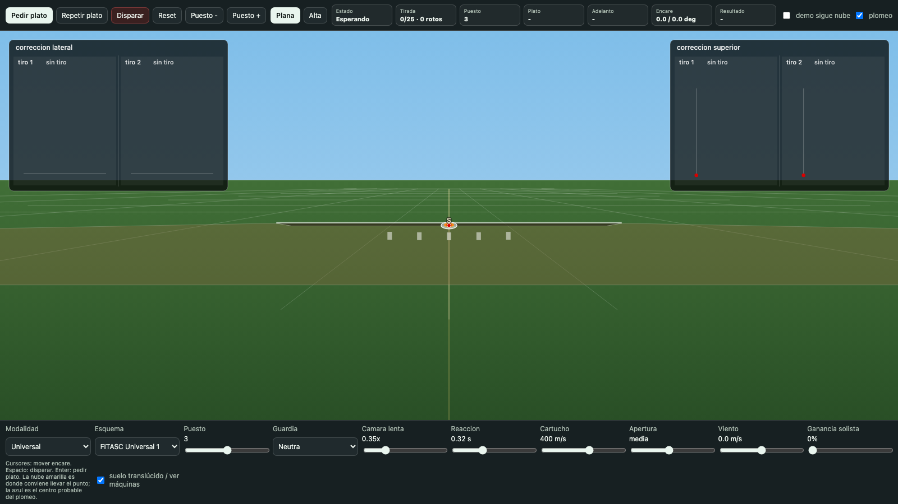
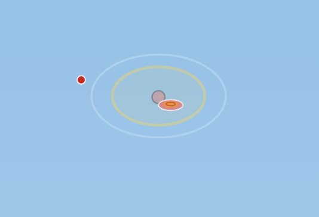
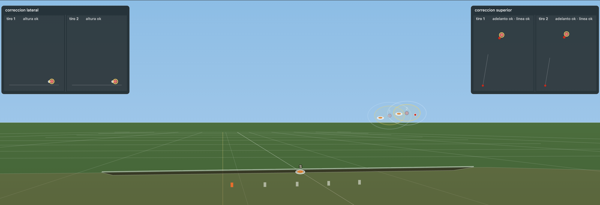
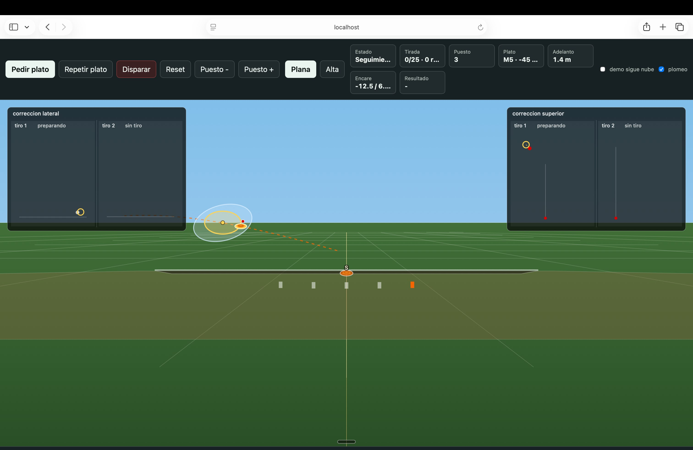

# Plato

Simulador 3D en HTML para estudiar el tiro al plato desde la perspectiva real del ojo del tirador. El objetivo no es inventar un juego abstracto, sino construir un laboratorio visual de física aplicada: salida del plato, velocidad, ángulo, reacción del tirador, adelanto, dispersión del cartucho y corrección tras el primer y segundo tiro.

La aplicación se ejecuta como una página HTML autónoma y renderiza la escena con `canvas`, sin dependencias externas. Está pensada para iterar rápido sobre la física y la representación visual antes de convertirla, si procede, en un juego completo o una experiencia VR.

**Probar la aplicación:** <a href="https://rcanalescoder.github.io/Plato/" target="_blank" rel="noopener">abrir el simulador en GitHub Pages</a>. En GitHub, el enlace directo a `index.html` muestra el código; GitHub Pages es la URL publicada que ejecuta la aplicación. El proyecto sigue siendo un único fichero ejecutable, por lo que también puede servirse localmente con `python3 -m http.server 8000` y abrir `http://localhost:8000/`.



## 1. Alcance

El simulador representa una tirada de 25 platos en dos modalidades:

- **Foso universal**: cinco máquinas dentro de una zanja. El señuelo naranja está centrado sobre la máquina 3 e indica el punto de salida del plato cuando la máquina está ajustada a cero grados.
- **Foso olímpico**: quince máquinas agrupadas en cinco puestos. En este modo el señuelo activo se desplaza delante del puesto del tirador y los otros posibles señuelos se muestran en gris.

El punto de vista principal es el del ojo derecho del tirador, situado a 1,70 m de altura. La escopeta no se dibuja como un objeto externo; el usuario ve el punto de mira rojo y, cuando hay ganancia de solista, un punto traslúcido que indica cómo sube el punto efectivo de impacto.

## 2. Controles

- **Pedir plato**: solicita un nuevo plato.
- **Repetir plato**: relanza el mismo plato anterior con la misma máquina, ángulo, altura y distancia. Sirve para estudiar platos muy laterales o rápidos.
- **Disparar**: dispara el cartucho actual.
- **Reset**: reinicia la tirada.
- **Puesto - / Puesto +**: cambia el puesto inicial o actual.
- **Plana / Alta**: alterna entre solista sin ganancia y solista elevada.
- **Ratón**: el cursor del juego es el propio punto rojo de mira.
- **Botón derecho**: pide plato.
- **Botón izquierdo**: dispara el primer y segundo tiro.

La escena no se mueve al apuntar. El suelo, el foso, el señuelo y las marcas permanecen fijos; lo que se mueve es el punto de mira, igual que en la percepción del tirador cuando conserva la cabeza alineada y desplaza la escopeta.

La proyección usa un campo de visión vertical fijo de 48 grados. Así el tamaño percibido del foso y del plato depende del ángulo de visión, no del formato exacto del monitor; una pantalla más ancha muestra más campo lateral, pero no debería alejar artificialmente la escena.

## 3. Geometría de Campo

El sistema usa metros como unidad interna.

| Elemento | Valor implementado | Referencia usada |
| --- | ---: | --- |
| Altura del ojo | 1,70 m | Modelo del tirador definido para el simulador |
| Línea de puestos a foso | 15 m | Reglas FITASC/ISSF |
| Profundidad visual del foso | 1,45 m | Aproximación de escena |
| Separación puestos universal | 2,50 m | Aproximación práctica para cinco puestos |
| Separación puestos olímpico | 3,15 m | Rango ISSF 3,00-3,30 m |
| Máquinas universal | 5 | FITASC Universal Trench |
| Máquinas olímpico | 15 | ISSF Trap |
| Altura de salida visible | 0,16 m | Boca de salida sobre la tapa del foso |
| Posición máquina bajo foso | 0,50 m bajo tapa y 0,50 m retrasada | FITASC Universal Trench 1.03 |

En universal, el señuelo naranja se mantiene antes del foso y sobre la línea central del puesto 3. En olímpico, el señuelo activo aparece delante del puesto desde el que se tira; los demás señuelos quedan en gris como referencia.

## 4. Normativa Usada

La implementación toma como guía normas y tablas oficiales, pero no pretende sustituir una homologación de campo.

- **Foso universal FITASC**: cinco máquinas dentro de la zanja, puestos a 15 m del borde delantero del foso y un plato/señuelo sobre la máquina 3 para indicar la salida a 0 grados. Las máquinas se modelan sobre bases alineadas, separadas 1,10 m, con el pivote aproximadamente 0,50 m bajo el techo del foso y 0,50 m retrasado del borde delantero.
- **Esquemas universal**: se modelan diez esquemas (`fu1` a `fu10`) con ángulos laterales de -45 a +45 grados, alturas de 1,5 a 3,5 m y distancias de 60 a 75 m.
- **Foso olímpico ISSF**: quince máquinas agrupadas en cinco grupos de tres, uno por cada puesto; se modelan nueve esquemas (`issf1` a `issf9`) con distancia objetivo de 76 m.
- **Plato**: se representa como disco naranja macizo con forma escalonada, aproximando el plato real de 110 mm de diámetro y 25-26 mm de altura descrito en reglas técnicas ISSF.

Fuentes consultadas:

- [FITASC, International Rules Universal Trench 2025](https://www.fitasc.com/upload/images/reglements/2025_rglt_fu_eng.pdf)
- [ISSF, Rules](https://www.issf-sports.org/rules)
- [ISSF technical target dimensions, PDF federativo](https://www.asia-shooting.org/wp-content/uploads/2023/01/ISSF_Technical_Rules_Draft_01.01.2023-6.pdf)
- [USA Shooting / ISSF General Technical Rules, referencia de puestos y foso](https://usashooting.org/app/uploads/2022/04/2013_USAS_GTR.pdf)
- [RIO Star Team EVO Training, ficha comercial](https://centerfiresystems.com/collections/ammunition-shotshells/products/rio-ammunition-star-team-evo-training-12-gauge-2-75-1-1-8-oz-7-5-shot-box-or-case)
- [Beretta, DT11 International Trap](https://www.beretta.com/en-us/product/dt11-international-trap-FA0095)
- [Beretta, guia de chokes OptimaChoke HP](https://estore.beretta.com/en-hu/utility/choke-tubes-guide)
- [Beretta, guia de seleccion de choke](https://www.beretta.com/en-us/blog/how-to-choose-the-right-shotgun-choke-tube)

## 5. Salida del Plato

Cuando se pide plato, la aplicación:

1. Mantiene el punto rojo en la guardia inicial durante el tiempo de reacción configurado.
2. Selecciona una máquina del esquema activo.
3. Calcula el vector de salida a partir del ángulo horizontal, la altura exigida a 10 m y la distancia normativa.
4. Lanza el plato desde la boca/rendija del foso en la planta del señuelo activo, con la máquina físicamente retrasada y por debajo.
5. Simula el vuelo con gravedad reducida y viento lateral opcional.

La posición del plato en el tiempo se calcula como:

```text
x(t) = x0 + vx*t + 0.5*wind*0.28*t^2
y(t) = y0 + vy*t - 0.5*g*0.42*t^2
z(t) = z0 + vz*t
```

El factor de gravedad reducido no intenta afirmar que el plato ignore la gravedad; compensa de forma práctica la sustentación aerodinámica del plato real para obtener una trayectoria visual y entrenable.

## 6. Adelanto

El área amarilla/translúcida representa la zona a la que conviene apuntar para que la nube de perdigones intercepte el plato. No es un punto mágico: es una estimación física recalculada en cada fotograma.



El cálculo parte de dos ideas:

- El plato se sigue moviendo mientras los perdigones viajan.
- Cuanto más lejos está el plato, más tiempo tardan los perdigones y más adelanto suele hacer falta.

La aplicación calcula primero una intersección aproximada entre plato y centro del disparo. Después afina el ángulo con una búsqueda local que minimiza la distancia entre el centro de la nube de perdigones y el plato usando el mismo integrador físico que se utiliza al validar el impacto.

## 7. Cartucho y Perdigones

El cartucho de referencia es RIO Star Team EVO Training. En la versión actual se modela como:

- Velocidad configurable del cartucho.
- Velocidad efectiva de perdigón: `velocidad_cartucho * 0.78`.
- 306 perdigones, aproximación compatible con una carga de 1 1/8 oz de plomo #7.5.
- Dispersión configurable por separado para tiro 1 y tiro 2.
- Patrón de nube determinista, no gaussiano, para aproximar un flujo de perdigones con anillos y variaciones internas.
- Un perdigón central que representa el núcleo del plomeo, más una nube distribuida alrededor.

La referencia de escopeta es una Beretta DT11 de trap. Beretta documenta el DT11 dentro de la familia de cañones/chokes OptimaChoke HP, y las configuraciones de trap suelen trabajar con chokes cerrados. En el simulador se usan valores iniciales conservadores:

| Disparo | Referencia práctica | Control inicial |
| --- | --- | ---: |
| Tiro 1 | 3/4 / Improved Modified, algo más abierto para plato cercano | 30 |
| Tiro 2 | Full, más cerrado para plato más alejado | 20 |

Estos controles no cambian el número de perdigones; reducen o amplían el radio del cono de plomeo. La fórmula actual es:

```text
radio_patron = 0.22 + apertura*0.0045 + distancia*(0.0035 + apertura*0.00003)
```

Donde `apertura` es el valor del control correspondiente al tiro actual. Valores bajos representan chokes más cerrados.

Cada disparo genera direcciones individuales para todos los perdigones. Para cada perdigón se simula su trayectoria y se comprueba si pasa a menos de 7,5 cm del centro del plato:

```text
px(t) = ojo.x + dir.x * velocidad * t
py(t) = ojo.y + dir.y * velocidad * t - 0.5*g*0.08*t^2
pz(t) = ojo.z + dir.z * velocidad * t
```

El plato se rompe solo si algún perdigón intersecta físicamente su volumen simplificado. Por eso se puede apuntar cerca del área ideal y fallar: la nube tiene dispersión, el plato se mueve, el usuario puede quedar ligeramente retrasado/adelantado/alto/bajo y el cálculo se evalúa contra partículas individuales. Cuando el simulador indica `Roto borde`, significa que el centro del plomeo no iba perfectamente centrado, pero un perdigón periférico alcanzó el plato.

La comprobación de impacto usa un paso temporal fino (`0,00045 s`) para evitar que un perdigón rápido salte de un lado a otro del plato entre dos muestras sin registrar la colisión.

## 8. Corrección Tras el Tiro

Las dos ventanas superiores ayudan a entender el error de forma separada:

- **Corrección lateral**: vista superior. Mide si el disparo quedó adelantado, retrasado o lateralmente fuera de línea respecto al punto ideal.
- **Corrección superior**: vista lateral. Mide si el disparo quedó alto o bajo.

Cada ventana está dividida en **tiro 1** y **tiro 2**, para comparar ambos intentos. La referencia amarilla es el punto físico recomendado; el punto rojo representa el encare del tirador; el azul claro representa el centro físico del plomeo del tiro actual. El aro amarillo y el aro azul se escalan por separado con su propia distancia 3D al ojo del tirador, porque pueden estar en profundidades distintas.

El control **Analisis** define cuantos segundos quedan visibles las pistas congeladas, los fragmentos y los rastros tras el disparo. Es una ayuda visual: no altera la fisica ni cuenta platos. La camara lenta tambien es visual; para probar una tirada a tiempo real hay que subir **Camara lenta** a `1.00x`.



## 9. Guardia y Solista

La aplicación distingue dos conceptos:

- **Guardia neutra**: el punto rojo empieza apuntando al señuelo.
- **Guardia alta**: el punto de salida inicial se coloca algo por encima y hacia el lado natural del puesto, como ayuda para no tapar el plato al arrancar.

La **ganancia de solista** modifica el punto efectivo de impacto. Visualmente:

- El punto rojo es donde el tirador apunta.
- El punto traslúcido muestra dónde impactaría el centro del disparo por la elevación de la solista.

Esto permite representar la diferencia entre una escopeta plana, que obliga a tapar más el plato, y una configuración con ganancia, donde se puede apuntar algo por debajo porque el disparo sale más alto que el punto de mira.

## 10. Tirada de 25 Platos

La tirada se modela como una serie de 25 platos:

- El contador muestra platos tirados y rotos.
- El tirador rota por los puestos 1, 2, 3, 4 y 5.
- El puesto no avanza hasta que termina el efecto de rotura o el análisis visual del fallo.
- El punto de partida puede cambiarse manualmente para comenzar desde otro puesto.



## 11. Limitaciones

El simulador es una herramienta de entrenamiento visual y experimentación. Las magnitudes físicas están expresadas en metros, segundos y grados, pero algunas constantes son aproximaciones calibradas para una experiencia comprensible en pantalla:

- La aerodinámica del plato se simplifica con gravedad efectiva.
- La pérdida de velocidad de los perdigones por resistencia del aire no está todavía modelada con una curva completa.
- El patrón de plomeo es determinista para que dos disparos comparables sean analizables.
- La probabilidad real de rotura depende de cartucho, choke, cañón, viento, calidad del plato y distancia efectiva.

## 12. Ejecución Local

Desde la carpeta del proyecto:

```bash
python3 -m http.server 8000
```

Luego abrir:

```text
http://localhost:8000/
```

## 13. Estructura

```text
.
├── index.html
├── README.md
├── docs/
│   └── screenshots/
└── auxiliares/        # scripts temporales locales, excluidos de git
```
